# 3D Viewer

3D viewer in WebGL and pure Javascript.

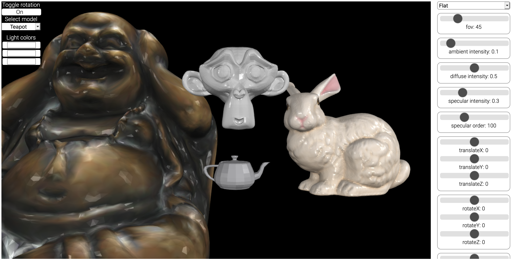

## Features
- Controllable Phong illumination model:
    - Ambient intensity
    - Diffuse intensity
    - Specular intensity
    - Specular order
- Controllable light source colors (currently 3 light sources)
- Controllable geometry:
    - Translation
    - Scaling
    - Rotation
    - 3D shear
- Controllable camera:
    - FOV (field of view)
- Controllable models
- Toggle Y-axis rotation animation

## Shadings
|Flat|Gouraud|Phong|
|--|--|--|
|||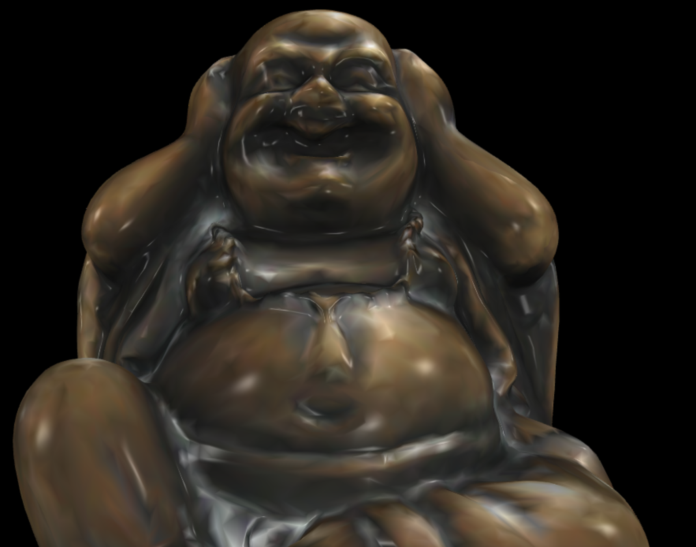|
||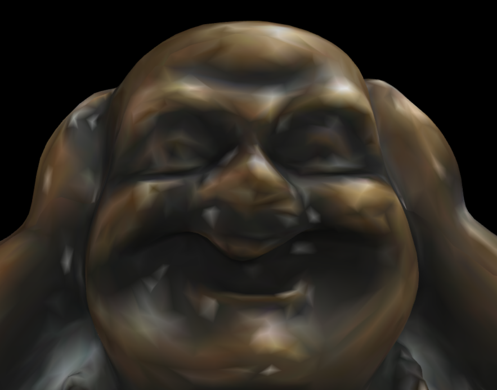|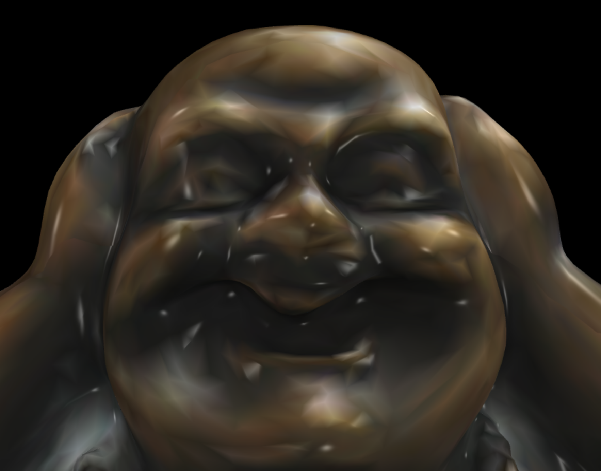|

## Phong illumination model
> "Suzanne" a.k.a Blender Monkey.

|Ambient|Diffuse|Specular|Full|
|--|--|--|--|
|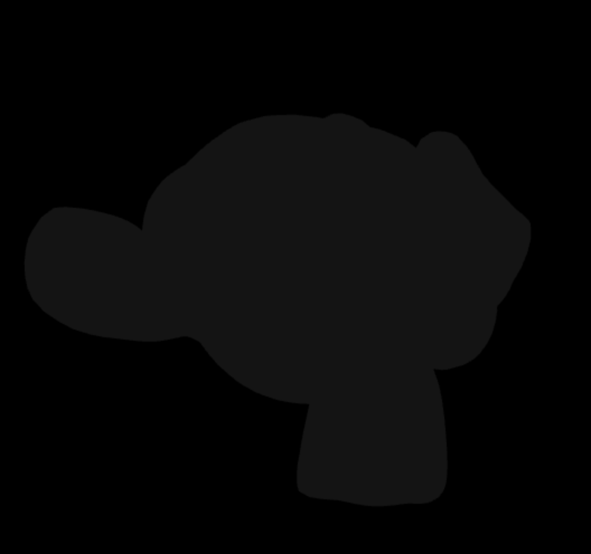||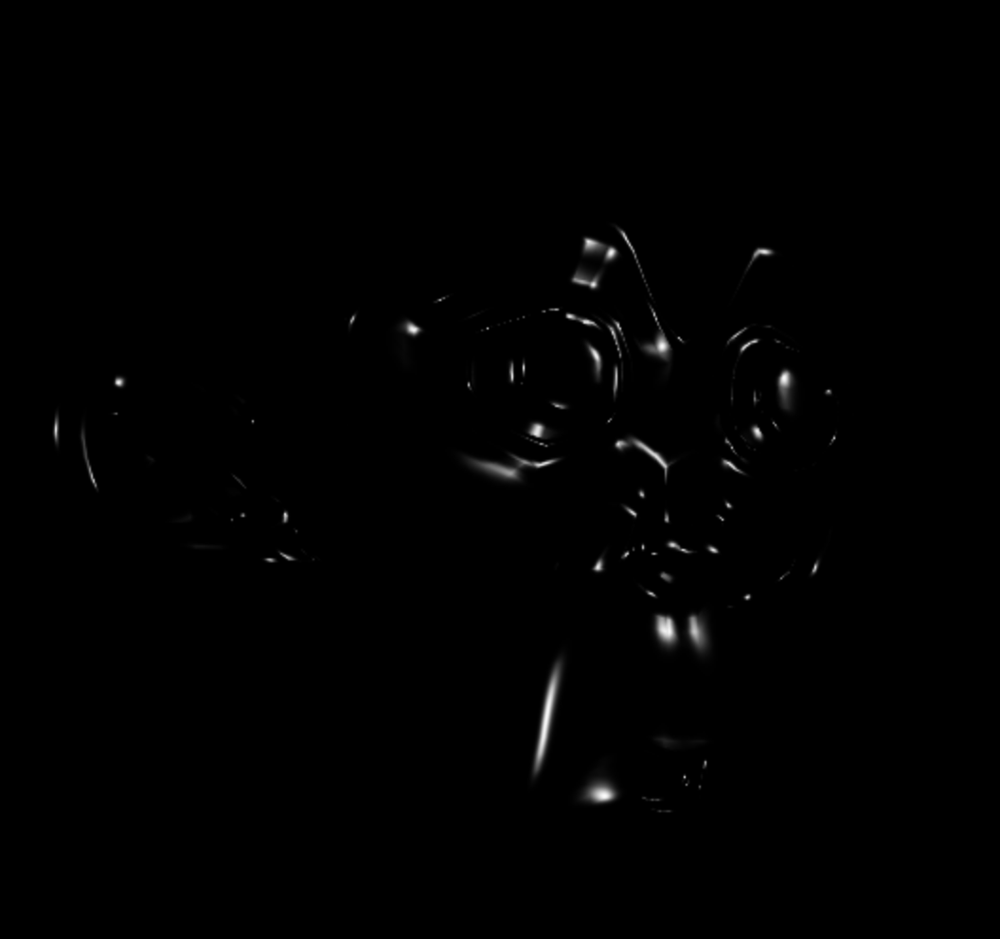|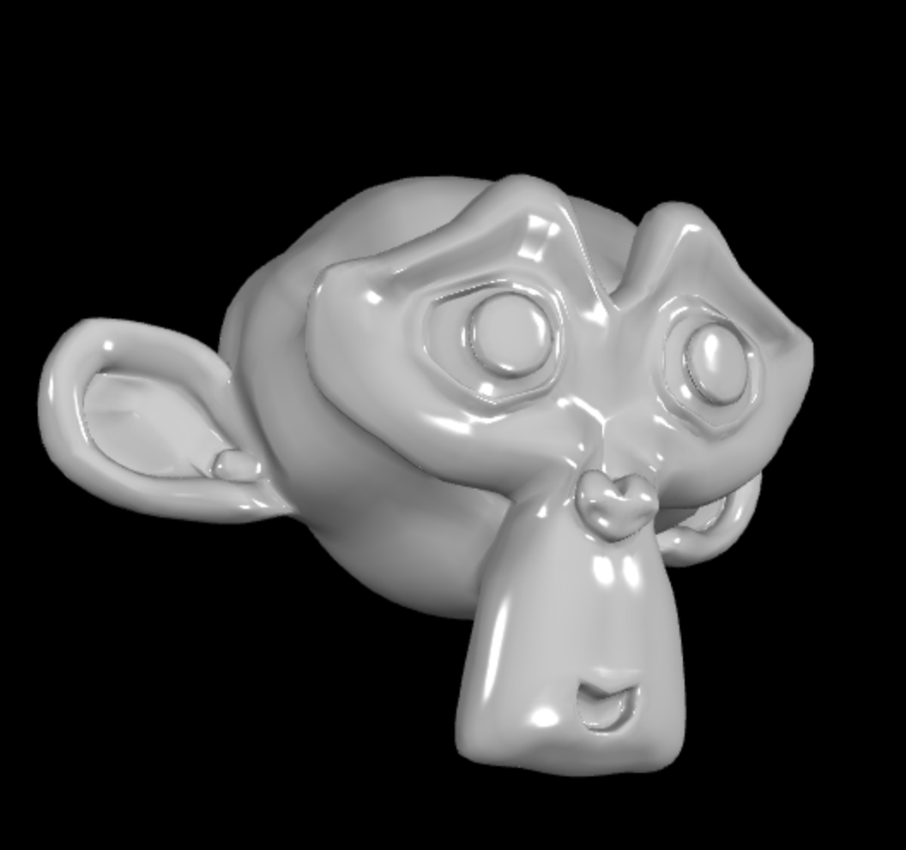|

|Low specular order (metal-like)|High specular order (glossy)|
|--|--|
|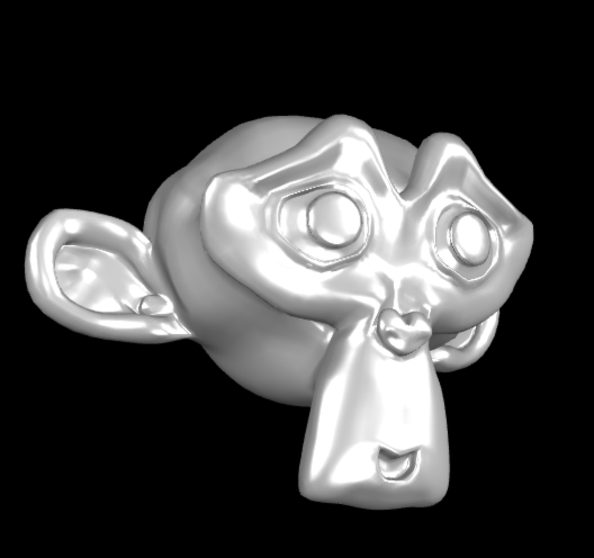|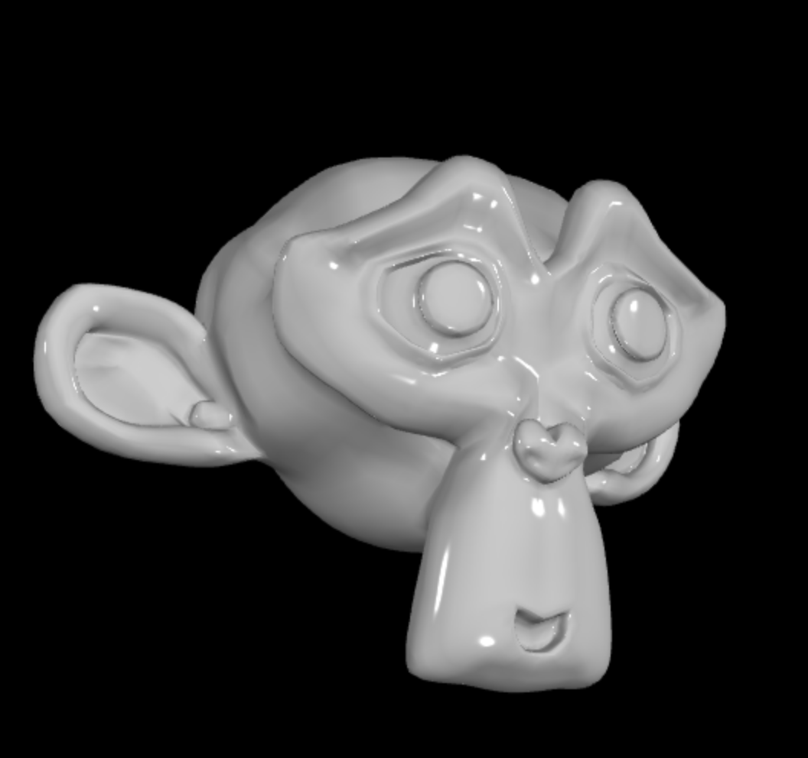|

## Model transformations
> "Stanford Bunny"

|Original|Rotate|Translate|Scale|Shear|
|--|--|--|--|--|
|||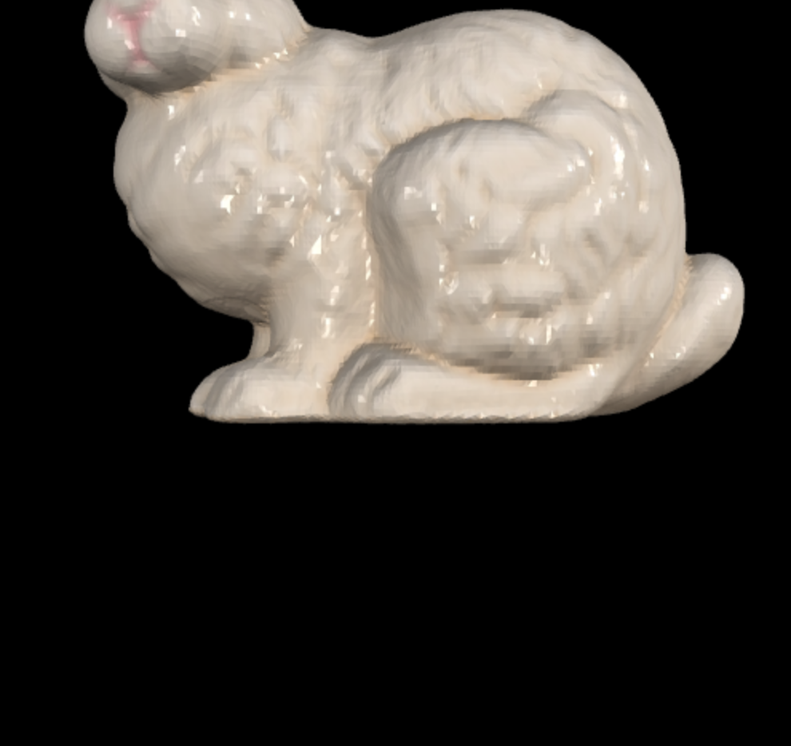|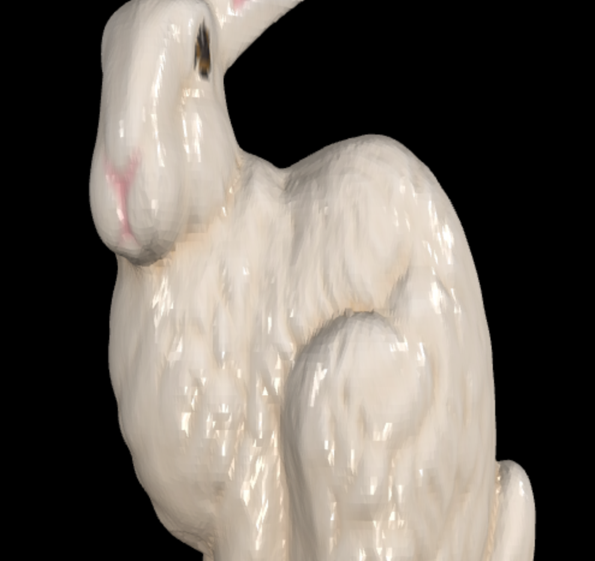|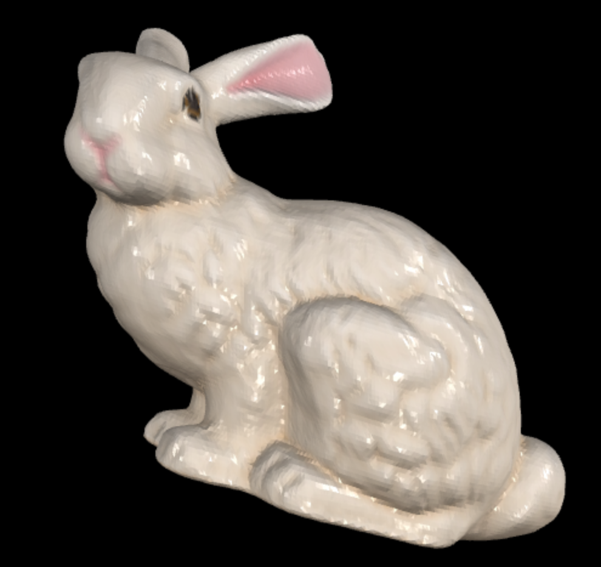|

